Bom dia!

# Meu Projeto Git

Projeto simples para aprender Git.

## Aprendizados

- Git init (resolvido)
- Commit
- Branch
- Pull Request
- ETC..

# Evidências

### Git Status (antes e depois)
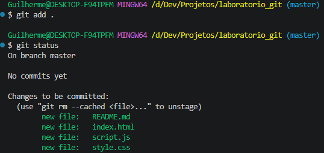
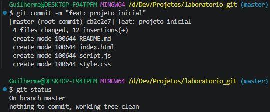

### Git Log
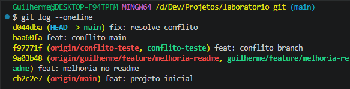

### Branch
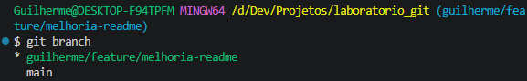

### Pull Request
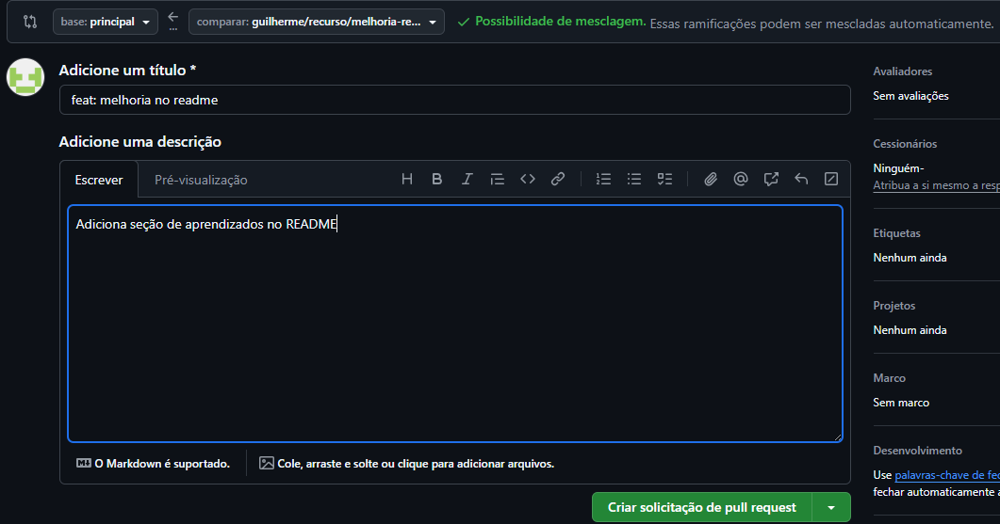
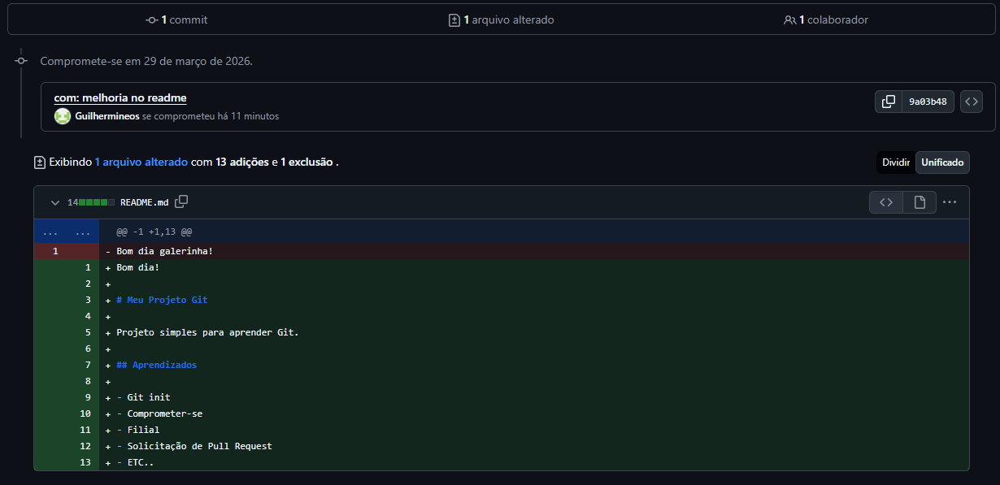

### Conflito 
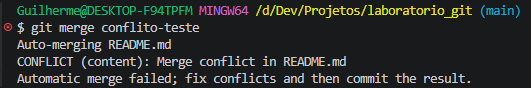
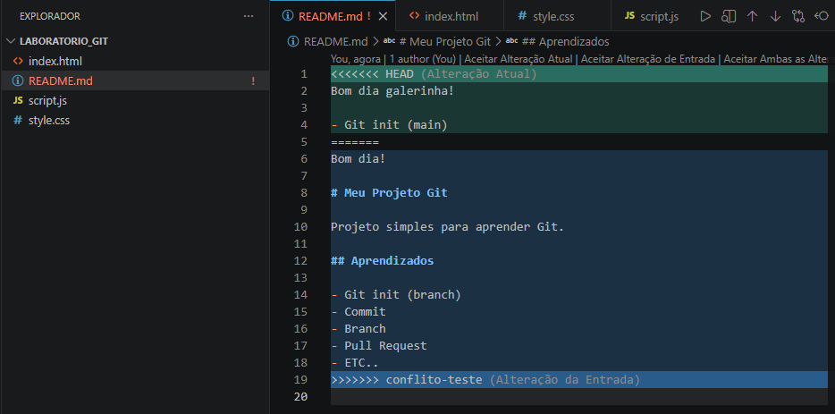

### Conflito Resolvido
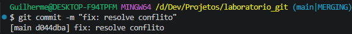
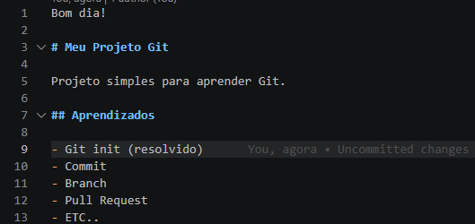

### Repositório Final
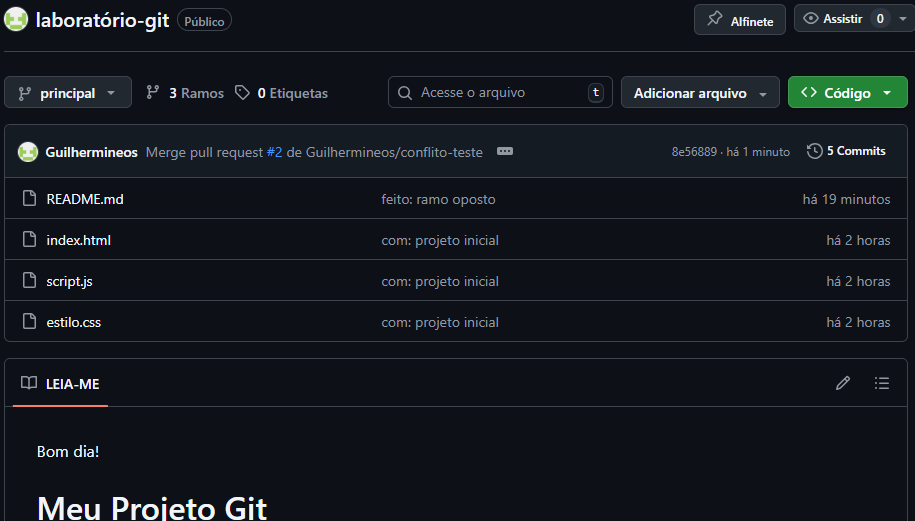
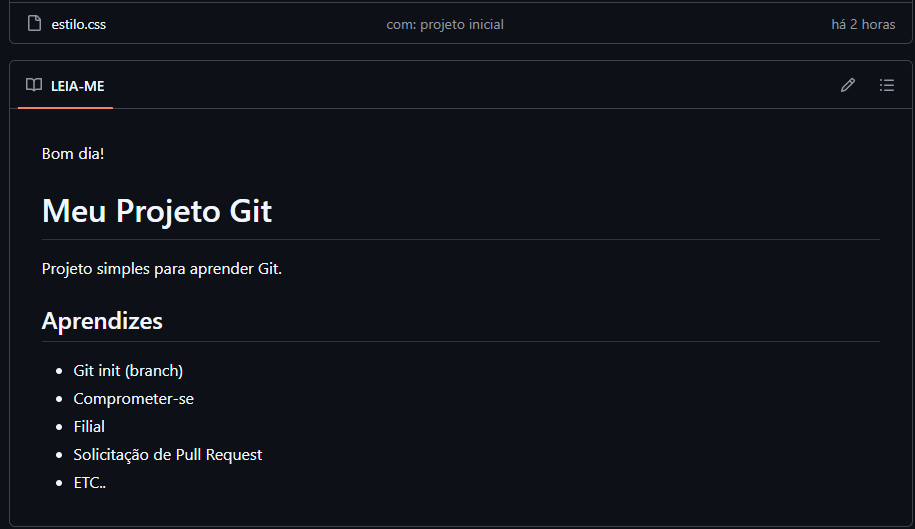